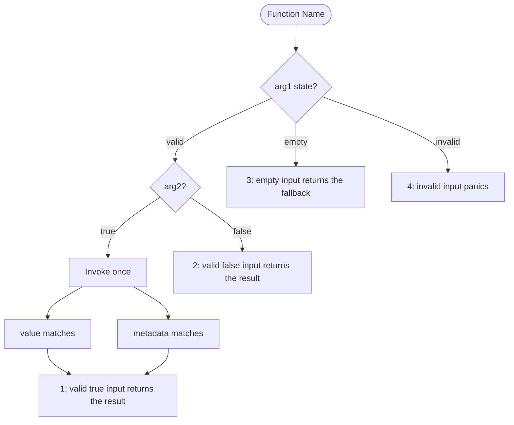
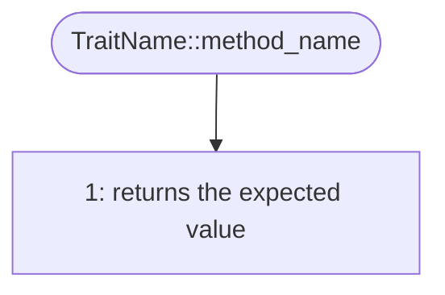

# MoonBit Markdown Tests

> Document type: concrete MoonBit test implementation guidance.

## File format

Use `.mbt.md` only when the task explicitly calls for literate executable documentation or rewriting an existing black-box test as such. Ordinary unit and integration tests follow [`file-layout.md`](file-layout.md). White-box tests remain `_wbtest.mbt` because Markdown tests cannot provide the required white-box visibility.

**Note on Filename**: The test file should be named `[Implementation File Name].md`. Do NOT include `_test` in the filename (e.g., `xy.mbt.md`, not `xy_test.mbt.md`).

### Code Blocks in Markdown

- `mbt`: Highlighting only (not compiled).
- `mbt check`: Highlighting and compiled. Use with explicit `test "title" { ... }` or `async test "title" { ... }` blocks.

For `async test`, follow [`execution.md`](execution.md#async-tests) for the required `moonbitlang/async` dependency, package import, target, and execution rules.

**Important**: Code blocks **must not be indented**. Even when included in a list item, the code block fence (\`\`\`) and its content must start at the beginning of the line.

### Document structure

Group executable examples by the public behavior or function they explain.
Use the structure below as an example, not a required document format.

For documents with several functions, headings and a short public API index can help readers navigate.
Group trait methods under their type or trait when that makes the behavior easier to find.

Explain the relevant conditions and expected observations in the smallest useful form: prose, a table, or a diagram.
A single case does not need a flowchart.
Use [share-test-design](../../share-test-design/SKILL.md) when deciding coverage and evidence, rather than requiring a separate design artifact.

Keep MoonBit-specific execution constraints:

- Follow [`names.md`](names.md) for test-title syntax and the required `panic_` prefix for expected panics.
- Follow [`assertions.md`](assertions.md#direct-results-and-raised-errors) for inspection APIs and `try!` in expected-error tests.
- Keep executable examples close to the behavior they explain.

#### Example with an optional flowchart

````markdown
# [Implementation File Name] (e.g., xy.mbt)

[Feature Summary / Documentation]
(Describe the core functionality provided by this implementation. **Do NOT mention that this file contains tests.**)

## Public API

- `func1`
- `func2`
- `TraitName`
  - `method_name`

## Test

### [Function Name]



```mbt check
///|
test "Function Name 1 - valid true input returns the result" {
  // One invocation, multiple observations
  let result = func1(valid_arg1, true)
  inspect(result.value, content="expected value")
  debug_inspect(result.metadata, content="ExpectedMetadata")
}

///|
test "Function Name 2 - valid false input returns the result" {
  // A different input uses a separate test block
  debug_inspect(func1(valid_arg1, false), content="Expected")
}

///|
test "Function Name 3 - empty input returns the fallback" {
  debug_inspect(func1(empty_arg1, false), content="Fallback")
}

///|
test "panic_Function Name 4 - invalid input panics" {
  try! (func1(invalid_arg1, false) |> ignore)
}
```

### [TraitName]

#### [method_name]



```mbt check
///|
test "StructName TraitName::method_name 1 - returns the expected value" {
  debug_inspect(trait_method(...), content="Expected")
}
```
````
