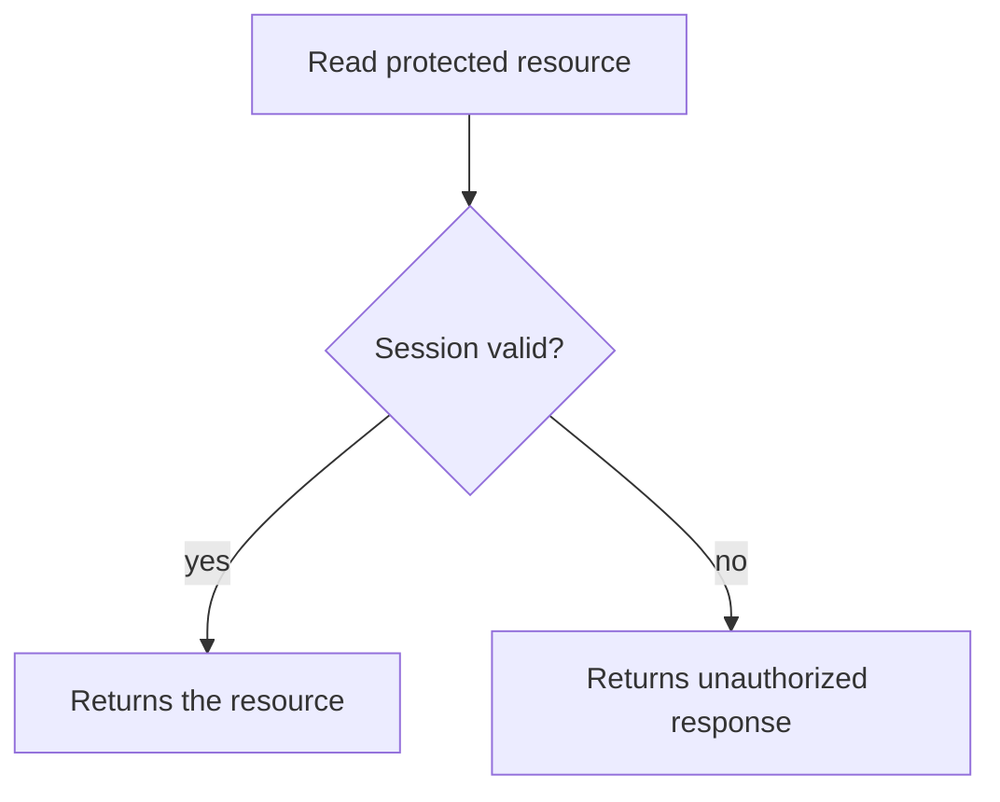

# Test-design presentation examples

These examples illustrate alternative ways to communicate a test design.
Adapt them to the reader's question; none is a required template or companion artifact.
Apply [documentation-principles](../../documentation-principles/SKILL.md) to choose the minimum sufficient form.

## A concise case

> Requirement: rejecting invalid input must not persist partial state.
> Given an empty store, submit an invalid record through the public write boundary.
> Expect the documented validation error and an unchanged store.
> A reproducible integration test is appropriate because the claim includes persistence behavior, not just local validation.
> Status: designed, not executed.

The error and unchanged store are related observations of one rejected operation.
The case does not need IDs, a flowchart, or separate design and flow files.

## A comparison table

A table helps when readers need to compare several cases or see a coverage gap.
The expected behavior below assumes a specification that defines these authentication responses.

| Requirement or risk                                    | Situation                                      | Expected observation                      | Evidence status                        |
| ------------------------------------------------------ | ---------------------------------------------- | ----------------------------------------- | -------------------------------------- |
| Valid credentials establish a session                  | Submit valid credentials                       | Success response and usable session       | Designed, not executed                 |
| Invalid credentials disclose no field-specific failure | Submit invalid credentials                     | Generic unauthorized response, no session | Designed, not executed                 |
| Session survives the deployment boundary               | Reuse the session through the deployed service | Authenticated access succeeds             | Blocked: deployment access unavailable |

The first two rows do not establish the deployed behavior in the third row.
If an agreed criterion lacks any observable verification method, stop and ask for clarification rather than filling the gap with an invented test.

## A branching diagram

A diagram can help reviewers understand alternate outcomes when branching is the main question.
This example shows expected behavior, not execution evidence.

Keep the relevant branch conditions and observations clear.
Split by concern when a diagram becomes difficult to scan, and identify intentionally untested branches when that matters to the review.
Labels may use descriptive names or existing case IDs; there is no required leaf syntax or local numbering scheme.
Code examples, state tables, or prose are equally valid when they explain the behavior more directly.

## An evidence note

> Executed: the local integration case rejected the invalid write and observed no new records.
> Limit: the case used a local database, not the deployed service.
> Not verified: deployment configuration and cross-service authorization.

Report only observations actually made.
Use result links or enough execution context to support the claim when available, and avoid duplicating long logs in the reader-facing explanation.
